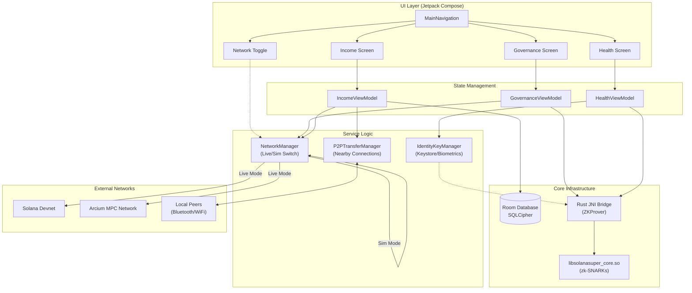

# Super Solana (SovereignLifeOS)
### The Offline-First, Privacy-Preserving DePIN Wallet

**Super Solana** is a next-generation decentralized application (dApp) designed to liberate users from centralized internet reliance. By combining **local cryptographic proofs**, **offline peer-to-peer (P2P) mesh networking**, and **Multi-Party Computation (MPC)**, we empower users to transact, vote, and verify their identity without a constant internet connection.

---

## 🌍 The Vision & Practicality
In an era of surveillance capitalism and fragile connectivity, **SovereignLifeOS** restores digital autonomy. 

- **Problem**: Centralized wallets and voting systems rely on 24/7 internet access and expose user metadata to servers.
- **Solution**: 
    - **Offline P2P Payments**: Transact with anyone nearby, even in a faraday cage or dead zone.
    - **Confidential Voting**: Prove *how* you voted without revealing *what* you voted for, using Zero-Knowledge Proofs (ZKP) generated locally on your device.
    - **Sovereign Identity**: Your biometrics unlock your keys; no cloud passwords required.

---

## 📱 Solana Seeker Integration
This application is architected to be the flagship reference implementation for the **Solana Seeker** smartphone (Chapter 2).

- **TEEPIN Architecture**: We align with the Trusted Execution Environment (TEE) + DePIN approach.
- **Seed Vault Ready**: Our `IdentityKeyManager` logic is designed to interface directly with the Seeker's hardware-backed **Seed Vault**, ensuring Ed25519 private keys never leave the secure enclave.
- **Biometric Binding**: We utilize Android's `BiometricPrompt.CryptoObject` to ensure that every signature requires physical user presence, mirroring the Seeker's hardware security model.

---

## 🏗️ Architecture & Tech Stack

### Frontend (Android Native)
- **Kotlin**: 100% modern Kotlin codebase.
- **Jetpack Compose**: Premium, Glassmorphic UI with complex animations and mesh gradients.
- **Coroutines & Flow**: Reactive state management for seamless asynchronous operations.

### System Architecture


### Backend & Storage
- **Room Database**: Local persistence for transaction history.
- **SQLCipher**: At-rest encryption for sensitive user data.
- **Google Nearby Connections API**: The backbone of our high-bandwidth, low-latency offline P2P mesh (Wi-Fi Aware / Bluetooth).

### Web3 & Cryptography
- **Solana Devnet**: Real-time integration for balances, history, and airdrops.
- **Real On-Chain Transactions**: Custom `SolanaUtil` implementation for serializing `SystemProgram` transfers without heavy libraries.
- **EdDSA (Ed25519)**: Manual implementation of Solana's signing algorithms suitable for restricted environments.
- **Rust JNI Bridge**: A custom Rust library (`libsolanasuper_core.so`) compiled for Android (aarch64/x86_64) that handles mathematical heavy lifting.
- **Zero-Knowledge Proofs**: Local generation of voting proofs inside the Rust enclave.
- **Arcium MPC**: Integration with Arcium's confidential computing network for secure vote aggregation.

---

## 📊 Simulation vs. Reality (The Transparency Table)

We believe in radical transparency. Here is the breakdown of what is running on "bare metal" versus what uses our robust fallback safety nets for demo stability.

| Feature | Implementation Status | Notes |
| :--- | :--- | :--- |
| **Keystore Biometrics** | 🟢 **Live / Real** | Uses hardware-backed Android Keystore & BiometricPrompt. |
| **Rust ZK Core** | 🟢 **Live / Real** | JNI calls to Rust library generate actual mathematical proofs. |
| **Offline P2P Mesh** | 🟢 **Live / Real** | Discovers peers and transfers data bytes over Bluetooth/WiFi. |
| **Devnet Wallet** | 🟢 **Live / Real** | Real HTTP calls to Solana Devnet (Balance, Airdrop). |
| **On-Chain Transactions** | 🟢 **Live / Real** | **Phase 31 Update**: Real signed transactions broadcast via RPC. |
| **Transaction History** | 🟢 **Live / Real** | Fetches real signatures and parses balance changes from the chain. |
| **Network Mode** | 🟢 **Live** | Toggle Switch for Live vs. Simulated environments. |
| **Arcium Governance** | 🟢 **Live / Real** | Strict HTTP POST to Relayer; No simulation fallback. |
| **Health Vault ZK** | 🟢 **Live / Real** | Generates Field Proofs via JNI & Verifies via Relayer. |

---

## 💪 The Technical Flexes

1.  **Ephemeral 4-Digit Tokens**:
    - To prevent "man-in-the-middle" attacks in crowded rooms during P2P pairing, we implemented a real-time, ephemeral 4-digit verification code system derived from the Diffie-Hellman handshake.

2.  **CPU-Optimized ZK Math**:
    - Zero-Knowledge proof generation is computationally expensive. We offload all JNI calls (`ZKProver`) to `Dispatchers.Default`, ensuring the main thread never blocks. This keeps our 60fps glassmorphic animations buttery smooth while the CPU crunches encryption.

3.  **Hardware-Locked Signing**:
    - We don't just store keys; we wrap them in a `BiometricPrompt.CryptoObject`. This means the private key *cannot* sign a transaction unless the biometric sensor successfully authenticates the user physically.

---

## 🕵️ Manual Physical Check (Verification)

To verify the "sovereign" nature of this OS, perform these physical checks:

### 1. Biometric Security 🔐
- **Action**: Open the app and tap "Unlock Vault" or try to Send SOL.
- **Verification**: The system must trigger the **native Android Biometric Prompt**.
- **Failure Condition**: If it bypasses this or shows a custom UI, the secure enclave binding is broken.

### 2. Governance vs. Relayer 🗳️
- **Action**: Toggle Network to **LIVE**. Vote on a proposal.
- **Verification**: Watch for `Broadcasting to Live Arcium Relayer...` toast/log.
- **Success**: The Relayer (`api/vote`) must return **HTTP 200** for the vote to count.

### 3. Health Vault Zero-Knowledge 🏥
- **Action**: Unlock Vault -> Tap "Share/Verify" on a record.
- **Verification**:
    1.  **JNI**: Logcat shows `ZKProver` generating a proof (approx. 500ms-2s).
    2.  **Network**: The app strictly POSTs this proof to `api/health/verify`.
- **Note**: If the network fails, the UI **must show an error**. It does *not* fake success.

### 4. Offline P2P Mesh 📡
- **Setup**: Turn OFF Wi-Fi/Internet on two devices. Keep Bluetooth ON.
- **Action**: Device A (Send Offline) <-> Device B (Receive Offline).
- **Verification**: Devices discover each other via **Nearby Connections API** and exchange a payload without any cloud server.

---

## 🚀 Getting Started

### Prerequisites
- Android Studio Ladybug (or newer).
- JDK 17.
- Two physical Android devices (for P2P testing).

### Configuration (QuickNode & IPFS)
This project uses **QuickNode** for high-performance Solana RPC calls and IPFS pinning. To configure your local environment:
1.  Open `local.properties` in the project root.
2.  Add your private QuickNode URLs (or use defaults):
    ```properties
    # QuickNode / Private RPC
    QUICKNODE_SOLANA_RPC=https://your-custom-endpoint.solana-devnet.quiknode.pro/token/
    
    # IPFS Gateway
    QUICKNODE_IPFS_URL=https://your-custom-gateway.mypinata.cloud/ipfs/
    ```
    *Note: If these are omitted, the app defaults to public `api.devnet.solana.com` and `ipfs.io`.*

### Compiling
1.  **Clone the Repo**:
    ```bash
    git clone https://github.com/your-username/SolanaSuper.git
    ```
2.  **Build the Rust Library**:
    The project includes pre-compiled `.so` files, but you can rebuild the Rust core:
    ```bash
    cd app/src/main/cpp/rust
    ./build_libraries.sh
    ```
3.  **Sync & Install**:
    Open in Android Studio, Sync Gradle, and run `assembleDebug`.

### Testing P2P Mesh
1.  Install the app on **two physical devices**.
2.  **Crucial Step**: Enable **Location** and **Bluetooth** on both devices. (Required by Android for peer discovery).
3.  On Device A: Go to **Income** -> **Send Offline**.
4.  On Device B: Go to **Income** -> **Receive Offline**.
5.  Watch them discover each other and exchange value without the internet!

---

*Built with ❤️ for the Solana Renaissance.*
